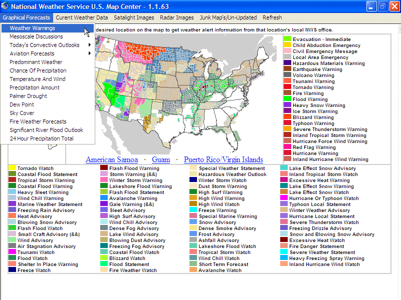



## National Weather Service U\.S\. Map Center \(Final Version\)

### Description

National Weather Service U.S. Map Center - Quick access to important NWS maps. If anyone learns of new maps that should be included in this application please post them !! Some of the current maps are experimental at the NWS. So be warned they may change over time. I have written this code so that it should be a snap for anyone to add more maps as they come available or are discovered. I have literally spent days upon days on this version of this application running down maps & down right busting my butt to create what you are about to download. The weather warnings & all other parts of this application are complete. So please take 10 seconds of your time to place your vote after testing the code.
 
### More Info
 

             |
---                |---
**Submitted On**   |2005-01-11 21:07:36
**By**             |[Thomas Swift](https://github.com/Planet-Source-Code/PSCIndex/blob/master/ByAuthor/thomas-swift.md)
**Level**          |Advanced
**User Rating**    |5.0 (55 globes from 11 users)
**Compatibility**  |VB 6\.0
**Category**       |[Complete Applications](https://github.com/Planet-Source-Code/PSCIndex/blob/master/ByCategory/complete-applications__1-27.md)
**World**          |[Visual Basic](https://github.com/Planet-Source-Code/PSCIndex/blob/master/ByWorld/visual-basic.md)
**Archive File**   |[National\_W1839131112005\.zip](https://github.com/Planet-Source-Code/thomas-swift-national-weather-service-u-s-map-center-final-version__1-58241/archive/master.zip)

